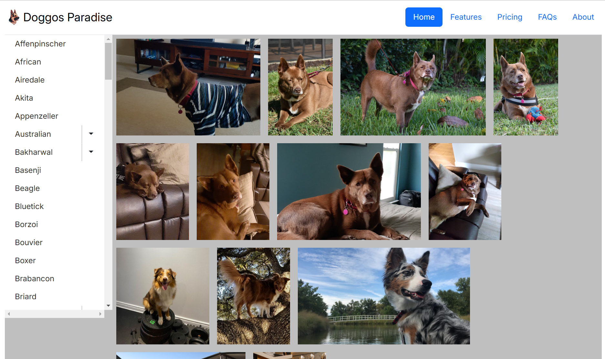

# Dog Image Website

## Goal
This project aims to learn how to use APIs in JavaScript by fetching data from the Dog API. The goal is to understand how to interact with APIs using JavaScript's `fetch`, `then`, `catch`, and `finally` methods.

## Features
- Fetch data from [Dog API](https://dog.ceo/dog-api/)
- Display images of different dog breeds and their sub-breeds
- Basic HTML formatting and string manipulation

## Technologies Used
- HTML
- JavaScript (with Fetch API)
- CSS (for basic styling)

## Live Link
[Dog Image Project API](https://dog-image-project-api.netlify.app/)

## Screenshot

## How to Run
1. Clone the repository to your local machine.
2. Open the `index.html` file in your browser.
3. The site will load the dog breeds and allow you to click on a breed to see the images.

## License
This project is open-source and available under the MIT License.
